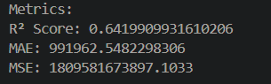

# House Price Predictor using Linear Regression

A machine learning project built in Python to predict house prices based on various features. This project uses a **Linear Regression** model to estimate property values.

## 📊 Features

- Preprocessed housing dataset (handled missing values, encoded categorical data, and scaled numerical features).
- Trained and evaluated a Linear Regression model.
- Evaluated using key regression metrics:
  - $R^2$ Score (Coefficient of Determination)
  - Mean Absolute Error (MAE)
  - Mean Squared Error (MSE)
- Includes a `requirements.txt` file for easy setup of the environment.

## 💻 Technologies Used

- Python
- Pandas & NumPy for data manipulation
- Matplotlib & Seaborn for data visualization
- Scikit-learn for modeling and evaluation

## 🚀 Getting Started

### 1. Clone this repository

```bash
git clone https://github.com/samwithwicky/house-price-predictor.git
cd house-price-predictor
```

### 2. Set up a virtual environment (optional but recommended)

```bash
python -m venv venv
# On Windows
venv\Scripts\activate
# On macOS/Linux
source venv/bin/activate
```

### 3. Install dependencies

```bash
pip install -r requirements.txt
```

### 4. Run the model

```bash
python house.py
```

## 📁 Project Structure

```
house-price-predictor
├── assets/
│   └── linear.png
├── house.py
├── Housing.csv
├── README.md
└── requirements.txt
```

## 📈 Model Evaluation Results

The performance of the Linear Regression model on the test dataset is as follows:



## 📂 Dataset Source

Dataset used: [Housing prices on Kaggle](https://www.kaggle.com/datasets/yasserh/housing-prices-dataset)

## 🔭 Next Steps

- **Feature Engineering:** Create new, more informative features from the existing data.
- **Try Advanced Models:** Experiment with other regression models like Ridge, Lasso, or ensemble methods like Random Forest Regressor and XGBoost.
- **Hyperparameter Tuning:** Optimize the model's parameters to potentially improve performance.
